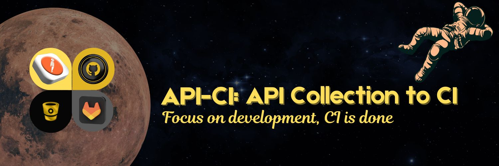

# API Collection to CI 


## Overview

API-CI removes the hassle of manually uploading Postman collections, whether they are from a UID or a saved file, into your CI/CD pipeline on GitHub, GitLab, or Bitbucket. It automates the process of exporting collections, setting up the required YAML pipeline, and making the initial commit, allowing you to focus on development rather than CI configuration.

## Prerequisites
To use API-CI, you will need:
- [ ] Postman API Key.
- [ ] **GitHub Setup:** GitHub Personal Access Token  
- [ ] **GitLab Setup:** GitLab Personal Access Token 
- [ ] **Bitbucket Setup:** Bitbucket App Password 

## Retrieving Postman API KEY
- Login to Postman Web or Desktop
- Click on the desired collection
- Click on **`Run`**
- Check the **`Automate runs via CLI`** radio button
- Click on **`Add API Key`**
- Click **`Generate Key`**
- Insert a name and click **`Generate`**
- Copy the Postman API Key

## Creating and Retrieving Tokens and App Password
### GitHub
- Login to GitHub
- Click on your profile picture in the upper-right corner, then click **Settings.**
- Scroll down and select **Developer settings.**
- Click Personal access tokens on the left menu, then click classic tokens or fine grained tokens.
- Click _"Generate new token"_, name it, set the expiration(or create a never expiring one).
- Select scopes (like repo and workflow, you can select all(recommended)). Click Generate token and copy the token.
- Save the token somewhere secure as once lost, it cannot be retrieved
### GitLab
- Login to GitLab
- Click on your profile picture in the upper-left corner and select Edit profile or Preference.
- Click **Access tokens** on the left side bar
- Click on **Add new token**
- Name it, set expiration, and check all boxes.
- Save the token somewhere secure as once lost, it cannot be retrieved
### Bitbucket
- Login to Bitbucket
- Click the Settings icon on the upper-right corner
- Click *Personal Bitbucket Settings*
- Click **App passwords**
- Name and create an app password and check all boxes
- Save the token somewhere secure as once lost, it cannot be retrieved

## Environment Variables Setup
### Windows
```
setx GITHUB_TOKEN "your_github_token"
setx POSTMAN_API_KEY "your_postman_api_key"
```
### MacOS/Linux
```
export GITHUB_TOKEN="your_github_token"
export POSTMAN_API_KEY="your_postman_api_key"
```
> [!NOTE]
> For _**GitLab**_ and _**Bitbucket**_, replace **GITHUB** with **GITLAB** or **BITBUCKET** to have **GITLAB_TOKEN** or **BITBUCKET_TOKEN**

## Usage
- `api-ci` to run generally whereby the user can select from the three pipelines
- `api-ci --github` to run a GitHub setup pipeline.
- `api-ci --gitlab` to run a GitLab setup pipeline.
- `api-ci --bitbucket` to run a Bitbucket setup pipeline.